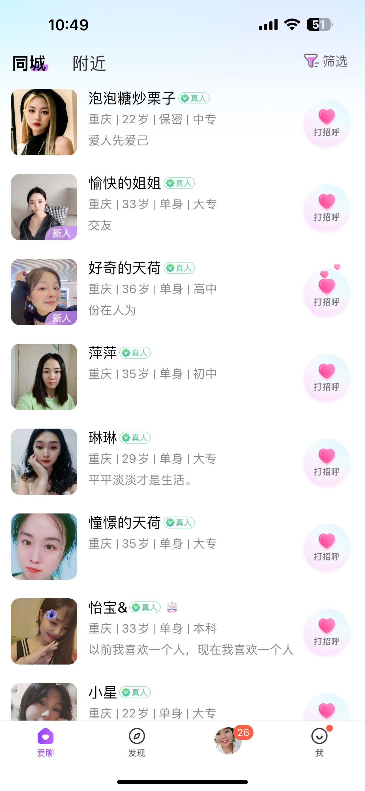
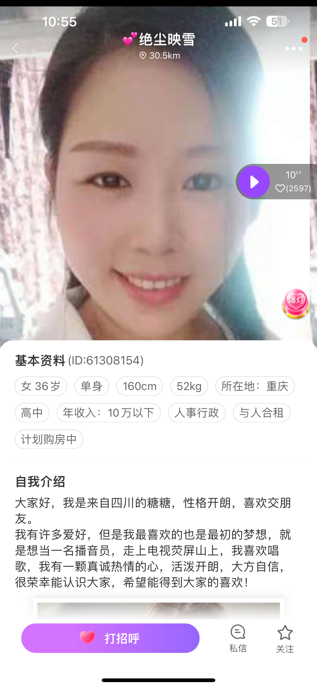
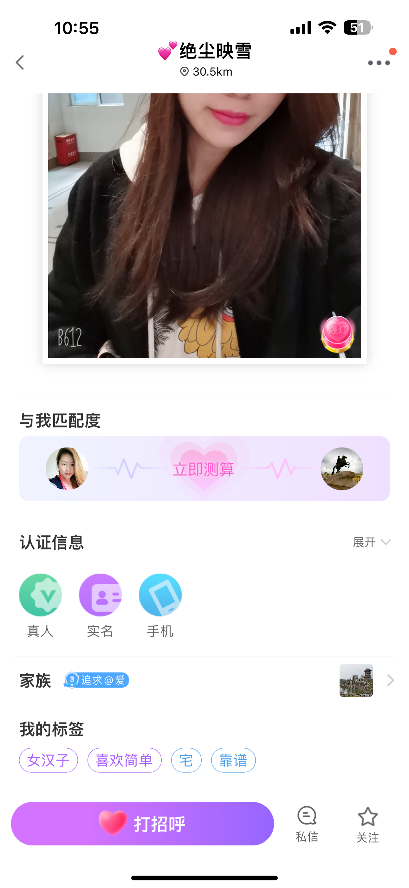
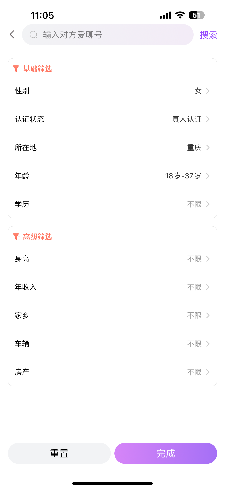
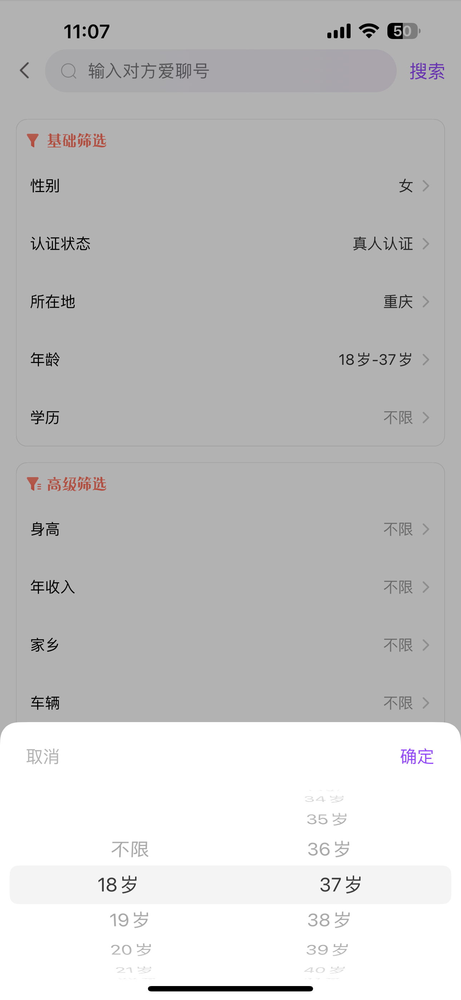
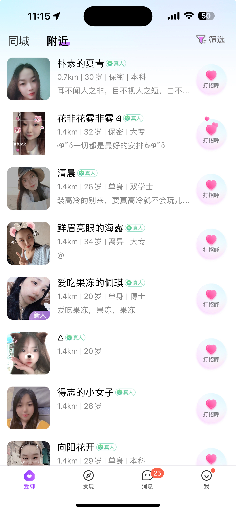
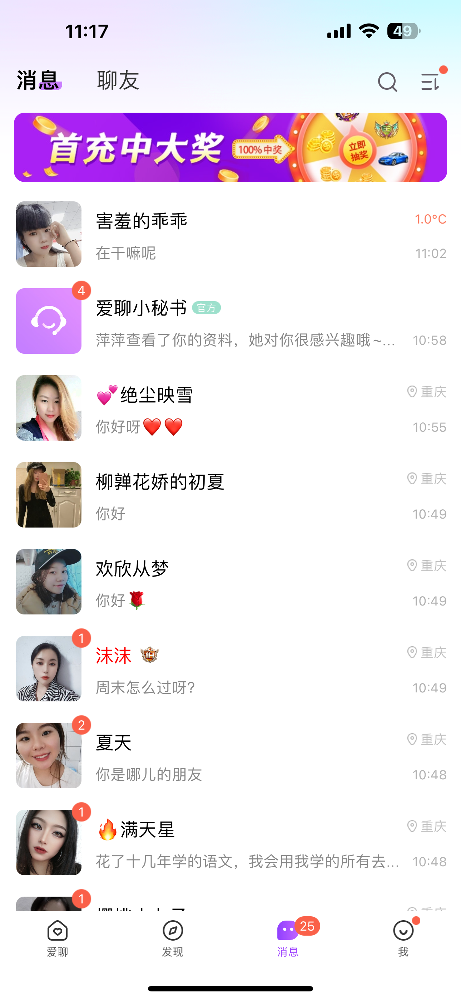

## 异性推荐列表

此功能一般出现在APP首页第一个tab。基本逻辑为：登录进入app后直接展示随机推荐列表，列表在顶部可进行分类，
包含【同城|附近】等。

具体列表逻辑如下：

- 每个列表包含的单项包含字段：
    - 头像、昵称、是否真人/实名认证、标签列表、是否新人、是否打过招呼等
- 单项右侧按钮：【打招呼】
    - 若已经打过招呼，则显示【去私信】按钮；
    - 点击打招呼成功后，转变为【去私信】按钮；
    - 按钮逻辑：后台主动代你和目标用户建立IM对话，发送内容一般为“你好，我是xxx”，
      但支持管理后台配置，比如根据目标是否新人选择对应的招呼语或随机招呼语。
- 列表自动刷新（前端）
    - 若用户超过{20}s未操作列表（上下滑、打招呼、进入单项用户主页等），则APP自动刷新列表。
    - 该时间可在管理后台配置，APP通过接收server推送实时更新，小于 10 时不刷新（固定逻辑，避免错误配置）。
- 用户主动刷新：位于第一页时，下滑触发。
- 筛选：右上角的筛选按钮，点击后弹出筛选弹窗。
- 列表永不为空（后端）：即用户打过招呼的用户会排在列表底部，打过招呼的用户的【打招呼】按钮应转变为【去私信】。

### 接口

- [ext.proto - 异性用户推荐](../../proto/svc/userpb/ext.proto)

### 图示

以下截图来自上市APP【爱聊】。

